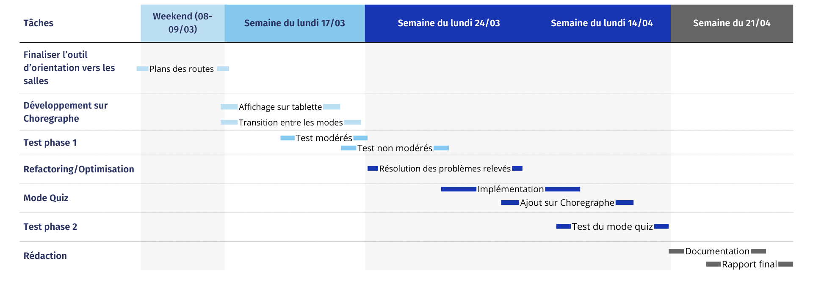

# Etat d'avancement
##### Projet : AMS Projet Sujet 1
##### Date : 4 Mars 2025
##### Responsable : Anis Saa & Grégoire Pierrot

---

## --Résumé de l'avancement--

Le projet suis globalement le planing prévue, un léger ajustement a dû être fait pour correspondre aux différents emplois du temps de l'équipe mais le projet est dans les temps. Il atteint la fin de sa phase de développement. 
À ce jour notre projet compte 3 des 4 fonctionnalités majeurs défini en début de projet, la dernière a dû être abandonnées suite à des problèmes techniques (API fermé).

 

    <table border style="width:auto;">
        <tr>
            <th>Ancienne Version*</th>
            <th>Status</th>
        </tr>
        <tr>
            <td>Orientation</td>
            <td style="display:flex; justify-content:center">✅</td>
        </tr>
        <tr>
            <td>Aides sociales</td>
            <td style="display:flex;justify-content:center">✅</td>
        </tr>
        <tr>
            <td>Recherche via LLM</td>
            <td style="display:flex;justify-content:center">✅</td>
        </tr>
        <tr>
            <td>Emploi du temps</td>
            <td style="display:flex;justify-content:center">❌</td>
        </tr>
    </table>
    
==>

    <table border style="width:auto;">
        <tr>
            <th>Nouvelle Version**</th>
            <th>Status</th>
        </tr>
        <tr>
            <td>Orientation</td>
            <td style="display:flex;justify-content:center">✅</td>
        </tr>
        <tr>
            <td>Aides sociales</td>
            <td style="display:flex;justify-content:center">✅</td>
        </tr>
        <tr>
            <td>Mode conversation</td>
            <td style="display:flex;justify-content:center">✅</td>
        </tr>
        <tr>
            <td>Code QR</td>
            <td style="display:flex;justify-content:center">🕐</td>
        </tr>
        <tr>
            <td>Quiz</td>
            <td style="display:flex;justify-content:center">❌</td>
        </tr>
    </table>

*Version initialement prévu en décembre 2024 **Version prévu actuellement

  

#### Description des fonctionnalités prévues :
- **Orientation :** Aide à l'orientation au sein du CERI. Cet outil s'activera si l'utilisateur demande au robot de lui indiquer une salle spécifique. 
- **Aides sociales :** Suggère des aides possibles pour des difficultés définies (difficultés financières, de logement, retraite, etc). Cet outil s'activera si l'utilisateur énonce clairement au robot qu'il souhaite recevoir un conseil/aide.
- **Mode Conversation :** Une conversation avec le robot (via un LLM) qui sera enregistré pour permettre à l'utilisateur, une fois la conversation terminée, d'avoir un historique de cette conversation. Cet outil s'activera si l'utilisateur demande au robot de démarrer une conversation, celle-ci sera enregistré jusqu'à ce que l'utilisateur dise : "Stop", un Code QR s'affichera sur la tablette.
- **Code QR :** Un Code QR affiché sur la tablette du robot qui permet à l'utilisateur de télécharger en version pdf le résultat du dernier outil utilisé (Plan, Aides, Historique, Quiz).
- **Quiz :** Une série de questions orientées sur l'informatique (les questions seront énoncé par le robot, et l'utilisateur y répondra oralement). Cet outil s'activera si l'utilisateur demande de faire un Quiz.

 

#### Problèmes rencontrés et contraintes :
- **Compatibilité d'emplois du temps :** Les différents emplois du temps et contraintes des deux membres de l'équipes ont dû amené à un léger remaniement du planning initial (mentionné dans le cahier des charges).
- **Emploi du temps :** La fonctionnalité initialiement prévue : "Emploi du temps" n'a pas pu être réaliser puisque l'API faite par le CERI n'est plus en focntionnement. La solution aurait été de faire une base de donnée en prenant les infos déjà disponible seulement la base de données est statique tandis que eux, les emplois du temps peuvent encore varié. Pour éviter tout problèmes, nous avons décider de mettre de côté cette fonctionnalité et d'approfondire les autres.
- **Téléchargement :** Le téléchargement des fichiers pdf (via Code QR) peut se faire uniquement si l'appareil de l'utilisteur est connecté au même réseau que le serveur (qui sera connecté sur le réseau du CERI).

 

Une fois la phase de développement fini, ce sera la phase de test qui prendra le relais, elle comportera deux parties :

|Test               |Description                                                                                                                |
|:-----------------:|:-------------------------------------------------------------------------------------------------------------------------:|
|Tests modérés      |Tests réalisé en présences d'un facilitateur (déjà en cours de rédaction) afin d'observer et de guider les utilisateurs.   |
|Tests non modérés  |Tests réalisé sans supervision directe en "conditions réelles".                                                            |

 
Les résultats des ces tests nous serviront à détécter les potentiels bugs et failles que notre code peut contenir. Ils nous serviront également à élaborer une nouvelle phase de test si une deuxième est nécessaires ainsi qu'à la documentation utilisateur.

### Détail des Éxigences
##### Tableau de Suivi des Exigences

<table style="font-size:13.5px">
  <tr>
    <th>Catégorie</th>
    <th style="border-left: 2px solid black;">Exigence</th>
    <th>Priorité</th>
    <th>État d'avancement</th>
    <th>Responsable</th>
    <th>Commentaires</th>
  </tr>
  <tr>
    <td rowspan="2">Mode Conversation</td>
    <td style="border-left: 2px solid black;">Dialogue avec l'utilisateur</td>
    <td>Haute</td>
    <td>Terminé</td>
    <td>Grégoire</td>
    <td>L'utilisation du LLM Fireworks permets un dialogue cohérent</td>
  </tr>
  <tr>
    <td style="border-left: 2px solid black;">Historique de conversation</td>
    <td>Haute</td>
    <td>Terminé</td>
    <td>Grégoire</td>
    <td>Il est possible de visionner/télécharger l'historique via un QR Code</td>
  </tr>
  <tr>
    <td rowspan="6">Mode Assistant</td>
    <td style="border-left: 2px solid black;">Orientation vers les salles et différents dispositifs</td>
    <td>Haute</td>
    <td>Quasi-terminé</td>
    <td>Anis</td>
    <td>Le plan de base est prêt, il ne reste que le traçage des routes vers chaque salle.
        + Le plan est visionalbe sur son téléphone (via un QR Code).
    </td>
  </tr>
  <tr>
    <td style="border-left: 2px solid black;">Orientation vers aides sociales/financières</td>
    <td>Haute</td>
    <td>Terminé</td>
    <td>Anis</td>
    <td>Base de données complétée
        + Plus de détails sur l'aide sont consultable sur téléphone (via un QR Code).
    </td>
  </tr>
    <tr>
    <td style="border-left: 2px solid black;">Consultation de l’emploi du temps</td>
    <td>Haute</td>
    <td>Annulé</td>
    <td>____________</td>
    <td>API non fonctionnelle</td>
  </tr>
  <tr>
    <td style="border-left: 2px solid black;">Recherche d’une salle libre</td>
    <td>Moyenne</td>
    <td>Annulé</td>
    <td>____________</td>
    <td>API non fonctionnelle</td>
  </tr>
  <tr>
    <td style="border-left: 2px solid black;">Fonction de recherche</td>
    <td>Haute</td>
    <td>Remplacé</td>
    <td>____________</td>
    <td>Le mode conversation englobe déjà cette fonctionnalité</td>
  </tr>
    <tr>
    <td style="border-left: 2px solid black;">Affichage sur la tablette</td>
    <td>Moyenne</td>
    <td>Non commencé</td>
    <td>____________</td>
    <td>Testé sur un émulateur en attendant l'accès au robot</td>
  </tr>
    <tr>
    <td rowspan="1">Mode Quiz</td>
    <td style="border-left: 2px solid black;">Réalisation d'un quiz via l'interaction avec le robot</td>
    <td>Très Basse</td>
    <td>Non commencé</td>
    <td>____________</td>
    <td>C'est un ajout potentiel en cas de marge de temps suffisante</td>
  </tr>
  <tr>
    <td rowspan="4">Tests</td>
    <td style="border-left: 2px solid black;">Fiche d'évaluation/satisfaction</td>
    <td>Moyenne</td>
    <td>En cours</td>
    <td>Grégoire & Anis</td>
    <td>Questions en cours de rédaction. Un formulaire (réalisé avec GoogleForm) sera partagé en ligne afin de regrouper les avis de chacun.</td>
  </tr>
  <tr>
    <td style="border-left: 2px solid black;">Tests utilisateurs modérés</td>
    <td>Moyenne</td>
    <td>Non commencé</td>
    <td>Grégoire & Anis</td>
    <td>Préparation des scénarios de test</td>
  </tr>
  <tr>
    <td style="border-left: 2px solid black;">Tests utilisateurs non modérés</td>
    <td>Moyenne</td>
    <td>Non commencé</td>
    <td>Grégoire & Anis</td>
    <td></td>
  </tr>
  <tr>
    <td style="border-left: 2px solid black;">Mesure des indicateurs de performance</td>
    <td>Basse</td>
    <td>Non commencé</td>
    <td>Grégoire</td>
    <td>À définir après les premiers tests</td>
  </tr>
</table>

---

### Diagramme de GANTT
**Planification des tâches restantes du projet :**
Ajustée en fonction du temps disponible : les week-ends et lors des semaines d'alternance.

